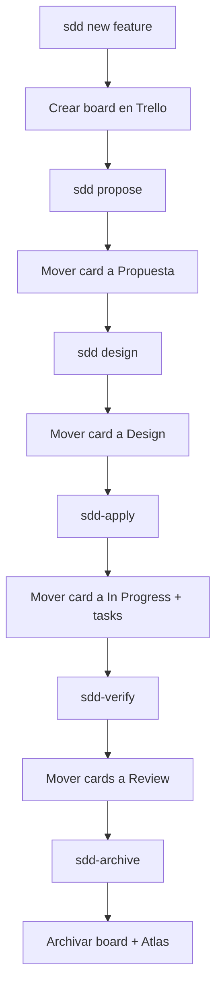

# Integración SDD ↔ Trello

## Flujo Completo



## Mapeo de Estados

| Fase SDD | Columna Trello | Color Card |
|----------|--------|---:----|
| propuesto | Propuesta | 🟡 #FFA500 |
| design | Design | 🔵 #0052CC |
| apply | In Progress | 🟣 #6554C0 |
| verify | Review | 🟠 #FF991F |
| archive | Done | ✅ #36B37E |

## Comandos

```bash
# Inicializar feature en Trello
trello sdd-init <feature-name> \
  --columns "Propuesta,Design,Apply,Review,Done"
  

# Sincronizar estado SQL → Trello
sdd status <feature>
trello sdd-sync --feature <feature>

# Crear tasks del sdd-tasks.json
trello sdd-tasks sdd-tasks.json

# Actualizar card cuando cambia estado en Trello
trello card move-to <card-id> --column "In Progress"
```

## Acción por Fase

| Fase SDD | Acción en Trello |
|----------|------------------|
| sdd-init | Crea board con columnas: Propuesta, Design, Apply, Review, Done |
| sdd-propose | Crea card "Propuesta" en columna Propuesta |
| sdd-design | Mueve card a columna Design |
| sdd-apply | Mueve card a columna Apply + crea cards para tasks |
| sdd-verify | Mueve cards a columna Review |
| sdd-archive | Archiva board + documenta en Atlas |

## Estado de Cards

| Columna | Estado | Significado |
|---------|--------|-------------|
| Propuesta | pending | Feature en propuesta |
| Design | design | En diseño técnico |
| Apply | in-progress | Desarrollo en curso |
| Review | review | Code review / testing |
| Done | done | Completado y desplegado |

## Reglas

1. **Un board = Una feature**
2. **La columna inicial es siempre "Propuesta"**
3. **Las tasks del sdd-tasks se crean con status "In Progress"**
4. **sdd-verify mueve todas las cards a "Review"**
5. **sdd-archive cierra el board y documenta en Atlas**

## Sincronización Bidireccional

1. SDD actualiza SQL → actualizar card en Trello
2. Trello mueve card → actualizar estado en SQL
3. Si hay conflicto → resaltar al usuario para resolución manual