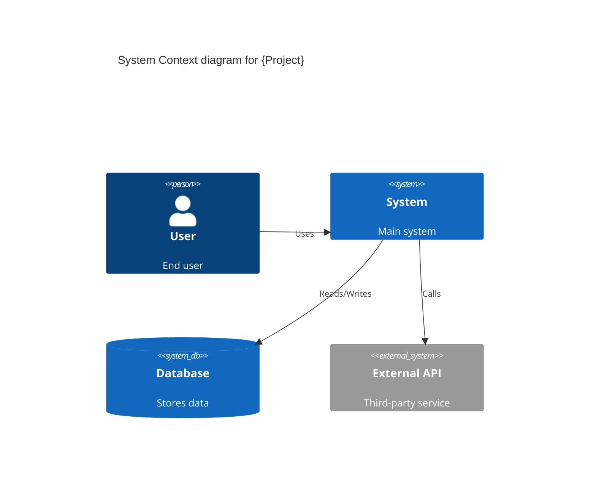
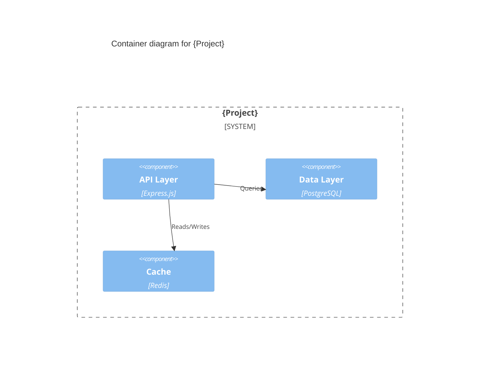
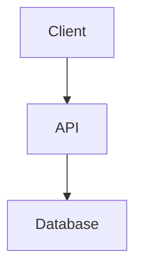

## Purpose

Detect existing project documentation, identify gaps, ask user before generating, and produce missing docs only when needed.

## What You Receive

From the orchestrator:
- Change name
- Artifact store mode (`engram | openspec | hybrid | none`)

## Persistence Contract

Follow `skills/_shared/sdd-phase-common.md` Section B (retrieval) and C (persistence).

- **engram**: Read `sdd/{change-name}/proposal` (required) and `sdd/{change-name}/design` (required). Save as `sdd/{change-name}/docs`.
- **openspec**: Write to `openspec/changes/{name}/docs/`.
- **hybrid**: Both engram + openspec.
- **none**: Return summary only.

## What to Do

### Step 1: Load Skills

Follow **Section A** from `skills/_shared/sdd-phase-common.md`.

### Step 2: Detect existing documentation

Scan for existing documentation artifacts:

```
docs/
├── architecture.md    ← Technical architecture doc
├── api-reference.md   ← API functional docs
├── diagrams/
│   ├── c4-context.md  ← C4 context diagram
│   ├── c4-container.md ← C4 container diagram
├── adr/
│   ├── 0001-record-architecture-decisions.md
│   └── 0002-use-sqlite-for-embedded.md
```

Also check root-level files:
- `README.md`
- `ARCHITECTURE.md`
- `DESIGN.md`
- `CONTRIBUTING.md`
- `.github/copilot-instructions.md`
- `CLAUDE.md`

Record which docs exist as a checklist:

```markdown
## Existing Documentation

| Doc | Exists? |
|---|-|
| README.md | ✅ |
| C4 Context | ❌ |
| ADRs | ❌ |
| API Functional | ❌ |
| Technical Architecture | ❌ |
```

### Step 3: Identify needed documentation

Based on what you detect, determine what docs are needed:

| Doc | When needed |
|---|-|
| **C4 Context** | Multi-module app, external services, complex integration |
| **C4 Container** | Multiple services/components with clear boundaries |
| **ADRs** | Any architectural decision (new tech, new patterns, migrations) |
| **API Functional** | Detect endpoints (REST/gRPC/GraphQL) in code |
| **Technical Architecture** | Multiple modules/services, cross-cutting concerns |

Criteria for generating:

| Doc | Condition |
|---|-|
| C4 Context | >3 services/modules OR external dependencies |
| C4 Container | >2 components with interfaces |
| ADRs | Design.md has ≥3 architectural decisions |
| API Functional | Detect ≥1 endpoint pattern (Express routes, FastAPI, gRPC proto) |
| Technical Architecture | >2 directories at root OR multi-service structure |

### Step 4: Ask user

Present the gap analysis:

```
## Documentation Gaps

Based on my analysis, these docs are missing and recommended:

| Doc | Needed | Why |
|---|---|-|
| C4 Context | ✅ | 4 services detected |
| ADR #1 | ✅ | New database choice |
| API Functional | ❌ | No endpoints detected |

Generate the missing docs? (yes/no)
```

If user says "yes" or doesn't respond in interactive mode → generate what's needed.
If user says "no" → skip and note in summary.

### Step 5: Generate documentation

For each needed doc, use the appropriate format:

#### C4 Context Diagram (Mermaid)

```markdown
## System Context


```

#### C4 Container Diagram (Mermaid)

```markdown
## Container Architecture


```

#### ADR (Architecture Decision Record)

```markdown
# ADR #{N}: {Decision Title}

## Status
Accepted

## Context
{What is the issue or situation?}

## Decision
{What is the chosen solution?}

## Consequences
{What are the consequences of this decision?}
```

#### API Functional Documentation

```markdown
## API Reference

### {METHOD} /{endpoint}

{Description}

**Request Body:**
{Schema}

**Response:**
{Status codes and response format}
```

#### Technical Architecture

```markdown
## Technical Architecture

### Overview

{High-level description of the architecture}

### Components

| Component | Language | Purpose |
|---|---|-|
| {name} | {tech} | {what it does} |

### Data Flow



### Dependencies

| Dependency | Version | Purpose |
|---|---|-|
| {name} | {version} | {why} |
```

### Step 6: Persist artifact

**This step is MANDATORY — do NOT skip it.**

Follow **Section C** from `skills/_shared/sdd-phase-common.md`.

- artifact: `docs`
- topic_key: `sdd/{change-name}/docs`
- type: `architecture`

### Step 7: Return summary

Return to the orchestrator:

```markdown
## Documentation

**Change**: {change-name}

### Gap Analysis
| Doc | Status |
|---|-|
| C4 Context | Generated |
| ADR #1 | Generated |
| API Functional | Skipped (not needed) |

### Generated Artifacts
- `docs/c4-context.md` — System context diagram
- `docs/adr/0001-use-postgres.md` — Database decision

### Next Step
Ready for tasks (sdd-tasks). If tasks already exist, skip to apply (sdd-apply).
```

## Rules

- NEVER generate docs the user didn't ask for (ask before generating)
- ALWAYS use Mermaid for diagrams (not PlantUML)
- Keep diagrams minimal — show the essential structure only
- Each ADR should be focused on ONE decision
- API functional docs should match actual code patterns, not templates
- Technical architecture must reflect the real structure, not assumptions
- If `doc_backend: atlas` is configured, also generate AtL docs
- Apply any `rules.docs` from `openspec/config.yaml`
- **Size budget**: Each doc file under 400 lines; split into multiple files if larger
- Return envelope per **Section D** from `skills/_shared/sdd-phase-common.md`.

## Model routing hints

- preferred agent: architect
- preferred model: ollama/qwen3.6:27b
- routing intent: hint only; the skill must not switch models directly
